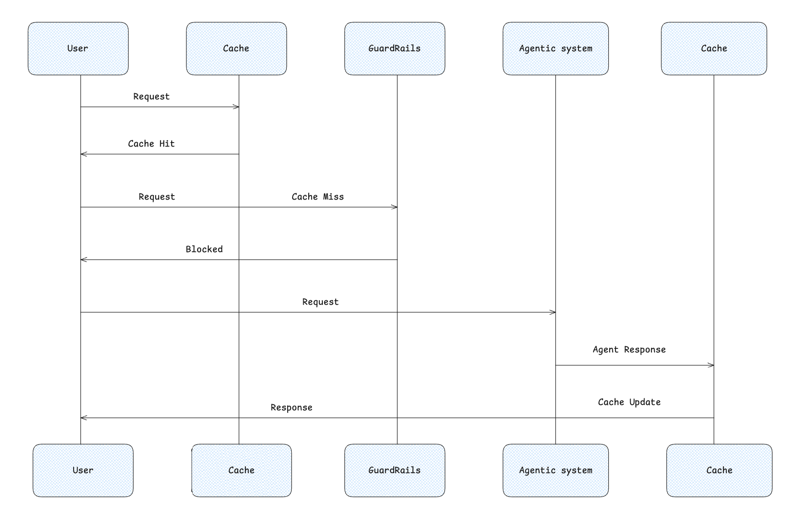
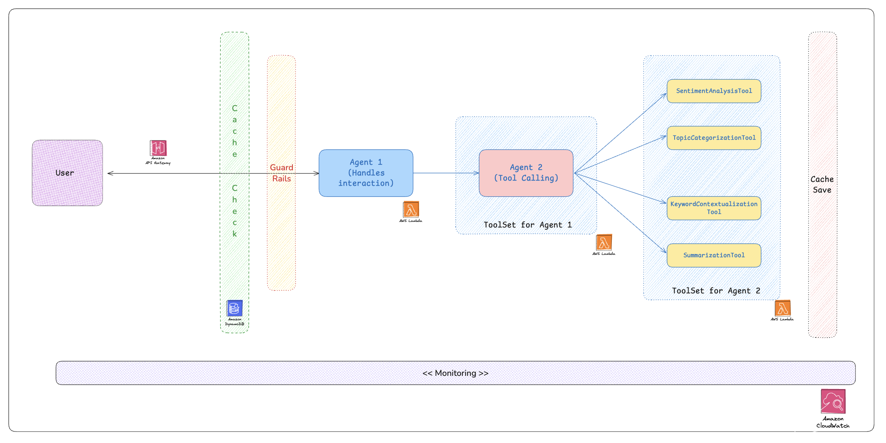
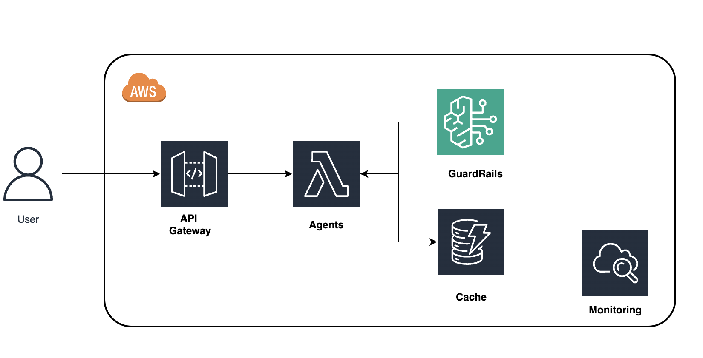

# expedite-commerce
Design and implement a smart LLM-driven multi agent solution capable of having guardrail & dynamically deciding which tools to execute based on specific instructions.

## Requirements  

| ⚡ Feature | 📌 Description |
|-----------|--------------|
| 📝 **Input Format** | Accepts **JSON** input with customer feedback and optional **instructions**. |
| 🤖 **Multi-Agent System** | 🎭 **User Agent**: Handles interaction & guardrails. <br> 🛠 **Tool Agent**: Executes required tools dynamically. |
| 🔄 **Dynamic Tool Selection** | Uses **LLM** (AWS Bedrock, Groq, OpenAI) to decide which tools to execute. |
| 🛠 **Tools** | ✅ **Sentiment Analysis** (Positive, Negative, Neutral) <br> ✅ **Topic Categorization** (Product, Delivery, Support) <br> ✅ **Keyword Extraction** (Context-aware keywords) <br> ✅ **Summarization** (Concise insights & actions) |
| 💾 **Caching** | Stores processed results to **avoid redundant execution**. (DynamoDB optional) |
| ☁️ **AWS Integration** | 🚀 **AWS Lambda** for execution <br> 📂 **DynamoDB** for storage (optional) <br> 📊 **CloudWatch** for monitoring |
| 📈 **Monitoring & Logs** | Logs **LLM decisions, tool execution, and cache performance** in CloudWatch. |
| ⚠️ **Error Handling** | Defaults to **executing all tools** if instructions are invalid. |
| 🌟 **Advanced Features (Extra Credit)** | 🧠 **Instruction Interpretation** (understands complex tasks) <br> 🚀 **Batch Processing** (handles up to **50 records per request**) |


## Architecture Diagram 

### Code Flow - 1


### Code Flow - 2


## Cloud Architecture


### API Schemas


### Single Invoke
```json
{
  "stream": "SingleInvoke",
  "request": {
    "feedback_id": "15345",
    "customer_name": "John Doe",
    "feedback_text": "The product is great, but the delivery was delayed.",
    "timestamp": "2025-01-10T10:30:00Z",
    "instructions": "Focus on identifying the sentiment and summarizing actionable insights."
  }
}
```

### Batch Invoke
```json
{
  "stream": "BatchInvoke",
  "request": [
    {
      "feedback_id": "15345",
      "customer_name": "John Doe",
      "feedback_text": "The product is great, but the delivery was delayed.",
      "timestamp": "2025-01-10T10:30:00Z",
      "instructions": "Focus on identifying the sentiment and summarizing actionable insights."
    }
  ]
}
```

## Cost Analysis
 

| Service       | Pricing Model                                      | Estimated Cost Considerations                          |
|--------------|-------------------------------------------------|-------------------------------------------------------|
| AWS Lambda   | $0.00001667 per GB-second + $0.20 per 1M requests | Cost depends on execution time, memory, and number of requests. |
| CloudWatch   | $0.30 per GB logs ingestion + $0.01 per 1K metrics | Logging and monitoring increase cost with more data & queries. |
| DynamoDB     | $0.25 per GB storage + $1.25 per 1M writes + $0.25 per 1M reads | Cost varies with data size and request volume. |
| API Gateway  | $3.50 per 1M requests (REST API)                  | Additional charges for data transfer and caching. |

---